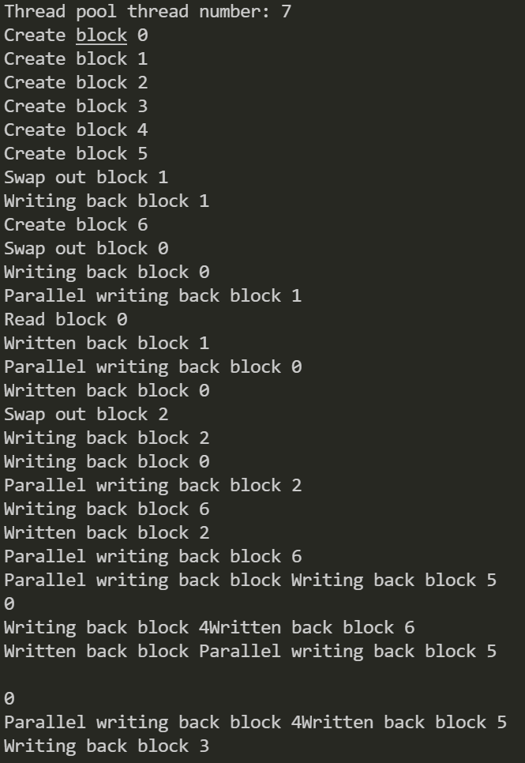

## 实验要求

> 设计并实现一个精简型单用户 SQL 引擎(DBMS) MiniSQL，允许用户通过字符界面输入输入 SQL 语句实现表的建立/删除；索引的建立/删除以及表记录的插入/删除/查找。
>
> 通过对 MiniSQL 的设计与实现，提高学生的系统编程能力，加深对数据库系统原理的理解。

### 需求概述

> * 数据类型
>
>   只要求支持三种基本数据类型：int，char(n)，float，其中 char(n) 满足： 1 <= n <= 255。
>
> * 表定义
>
>   一个表最多可以定义32个属性，各属性可以指定是否为 unique；支持单属性的主键定义。
>
> * 索引的建立和删除
>
>   对于表的主属性自动建立 B+ 树索引，对于声明为 unique 的属性可以通过 SQL 语句由用户指定建立/删除 B+ 树索引（因此，所有的 B+ 树索引都是单属性单值的）。
>
> * 查找记录
>
>   可以通过指定用 and 连接的多个条件进行查询，支持等值查询和区间查询。
>
> * 插入和删除记录
>
>   支持每次一条记录的插入操作；支持每次一条或多条记录的删除操作。

## 总体设计

### 组员分工

<!-- Git 版本隐去此信息，自己看 git log 去（逃 -->

### 模块设计与简要概述


*与实验指导书的设计略有不同，我们的模块设计中 Catalog Manager 不直接与 Interpreter 交互，而是通过 API 层进行中转。*

#### Interpreter

直接与用户进行交互，接收并结构化用户输入的命令，检测语法正确性后调用 API 层函数执行命令。

#### API

提供各个 SQL 语句的执行接口，供 Interpreter 层调用。在检验语义正确性后通过调用各个模块的接口执行命令。

#### Catalog Manager

负责管理数据库的所有模式信息，包括表的名称、字段、主键、索引等。

#### Record Manager

管理和记录表中数据，提供记录的插入、删除和查找等操作接口。保证 unique 等语义正确性。

#### Index Manager

由 B+ 树实现索引，提高命令运行速度。

#### Buffer Manager

负责缓冲区的管理。
1. 根据需要，读取指定的数据到系统缓冲区或将缓冲区中的数据写出到文件
2. 实现缓冲区的替换算法，当缓冲区满时根据 LRU 模式进行替换
3. 记录缓冲区中各页的状态
4. 提供缓冲区页的 pin 功能，防止正在被操作的页被换出

#### DB Files

指构成数据库的所有数据文件，包括记录数据、索引数据及 Catalog 数据等。

### 基本流程

<!-- TODO -->

## 详细设计

### API 模块

按顺序调用各个模块调用接口即可。

### Buffer Manager 模块

#### 对外接口

Buffer Manager 提供了基本的 Block 抽象。主要对外接口为以下三个：

``` c++
Block *Read(const size_t &block_id);

size_t Create(Block *block);

size_t NextId();
```

其中：

* `Read` 通过 block_id 取回对应的 block，如果 block 在内存中，则直接取回。如果不在，则从磁盘中读入 block，此时如果 buffer 已经满了，则找到未被访问时间最久的没有被 pin 住的 block，将其写回磁盘并换出 buffer。
* `Create` 将别的模块生成的新的 block 加入 buffer 中，若 buffer 已满，则与 `Read` 行为一致。
* `NextId` 返回下一个 `Create` 操作会返回的 block_id。

#### 实现细节

* Buffer Manager 在构造函数中读取了磁盘中最大的 block_id，实现了初始化。在析构函数中将所有还在 buffer 中的脏 block 全部写回磁盘，保证了数据安全性。
* Buffer Manager 有三个版本，通过编译选项进行开关：
  * 基础版本为裸实现。即文件写操作在主线程中执行。
  * 第二个版本通过 c++ 的 std::future 以及 std::async 实现了异步非阻塞的文件写操作，从而实现了数据库运算与 IO 并行，一定程度上优化了性能。（在 CMake 中通过 ParallelWrite 选项默认打开）
  * 第三个版本通过 std::mutex, std::atomic, std::condition_variable 等实现了一个线程池，在 MiniSQL 程序打开时默认新建（机器核数 - 1）个线程用于磁盘写操作。规避了在第二个版本中线程生成与销毁的开销，进一步优化了性能。（在 TaskPool.hpp 中通过宏定义 UseThreadPool 默认打开）

#### 模块测试

```c++
#include "BufferManager.hpp"

void BufferManagerTest() {
  auto a = new Block;
  memset(a->val_, 0x3f, sizeof(a->val_));
  const auto a_id = buffer_manager.Create(a);
  a->pin_ = true;
  a->dirty_ = true;
  for (int i = 0; i < Config::kMaxBlockNum; i++) {
    auto b = new Block;
    buffer_manager.Create(b);
  }
  a->pin_ = false;
  auto b = new Block;
  buffer_manager.Create(b);
  auto c = buffer_manager.Read(a_id);
}

```
通过上述代码测试基本的 read/write, dirty/pin 的功能。测试是通过修改 Config 明明空间下的参数调整 buffer 的大小测试不同情况。并行输出部分的性能测试不在此处进行，而是在整个程序对接完毕之后进行。

如图，是在 `Config::kMaxBlockNum` 为 5 的时候的输出：



### Catalog Manager 模块

#### 对外接口

正如**模块设计与简要概述**中所说，Catalog Manager 的主要功能是管理表格及其信息。所以其对外接口为 `CreateTable`, `DropTable`, `CreateIndex`, `DropIndex`, `TableInfo` 等。其作用与名字一致，即在检查语法和语义正确性之后对数据库模式信息进行修改。在此不做赘述。

#### 实现细节

* Catalog Manager 在构造函数中读取了磁盘中存下的数据库模式信息，实现了初始化。在析构函数中将数据库模式信息写回，保证了数据安全性。
* Catalog Manager 管理的模式信息由于经常读写且长度不一定在一个 block 范围内，所以不由 Buffer Manager 进行管理。它自己直接开设了一个文件实现了信息的永久保存。
* 为了提高性能，使用了 std::unordered_map 来保存了表名与表信息之间的映射。

#### 模块测试

```mysql
create table student (sno char(8), sname char(16) unique, sage int, sgender char (1), score float, primary key ( sno ));
create index stunameidx on student ( sname );
drop index stunameidx on student;
create index stunameidx on student ( sname );
drop table student;

```
通过上述代码测试基本的 create/drop table/index 的功能，为了方便查看，使用 gdb 以及 hexdump 观察结果而不是输出到 console 里面。

如图，是没有执行 `drop table student;` 时的状态：


### Index Manager 模块

#### 对外接口

​		Index Manager 负责针对数据进行 B+ 树索引的的实现。需要完成 B+ 树的创建和删除、等值查找、插入健值，删除健值等操作，因而其对外接口主要有：

```c++
bool CreateIndex(const Table &table, const string &index_name,
                   const string &column);

bool PrimaryKeyIndex(const Table &table);

bool DropIndex(const string &index_name);

void DropAllIndex(const Table &table);

bool InsertKey(const Table &table, const Tuple &tuple, Position &pos);

bool RemoveKey(const Table &table, const Tuple &tuple);

vector<Tuple> SelectRecord(const string &index,
                             const vector<Condition> &conditions);
```

其中：

* `CreateIndex`  通过输入table、索引名称以及索引属性，实现 B+ 树索引的建立；
* `PrimaryKeyIndex`  自动针对当前 table 内的 primary key 建立索引；
* `DropIndex`  删除该索引名称所对应的索引；
* `DropAllIndex`  删除一个 table 内的所有索引；
* `InsertKey`  将新插入的记录的各项属性值插入其所对应的索引内；
* `RemoveKey`  将新删除的记录的各项属性值从其所对应的索引内删除；
* `SelectRecord`  根据传入的 conditions 在索引内查找目标记录。

#### 实现细节

* Index Manager 在构造函数中读取自身存下的index信息文件，完成初始化过程；在析构函数中将完成所有操作后产生的新的index信息重新写入文件，确保数据完整一致。
* Index Manager 在一个缓冲区内保存一个结点，在进行针对结点的各项操作后，将结点的所有重要信息保存在对应缓冲区内。
* Index Manager 内封装了 getBplus 模块进行 B+ 树的各类操作，该模块每次锁定一个 B+ 树内的一个结点（每个节点都和一个缓冲区的块相对应），进行结点数据读取、根结点的生成、结点内数据遍历、结点内数据插入、结点内数据删除、结点分裂、结点合并、结点数据保存等等操作，并可以通过结点内保存的缓冲区模块的地址值进行结点的跳转，实现整个 B+ 树的各类操作；在跳转时，模块会自动对新旧缓冲区进行 pin 值标记，并在出现数据更新时进行 dirty 值标记以确保 buffer manager 对其进行保存。


### Interpreter 模块

#### 对外接口

```c++
void interpret();

tuple<bool, size_t> interpretFile(const std::filesystem::path &filename);

void setWorkdir(const std::filesystem::path &dir);

void show
```

其中：
* `interpret` 从 `stdin` 接受输入，并进行解析和后续执行
* `interpretFile` 打开由 `filename` 指定的文件，并进行解析和后续执行
* `setWorkdir` 设置当前 Interpreter 的工作目录，进而和 `interpretFile` 和 `execfile` 良好配合，实现对相对路径的正确解释及嵌套 `execfile` 命令的处理

#### 实现细节

* Interpreter 是手工编写的递归下降无回溯LL(1)语法分析器。对于MiniSQL文法中的每一个非终结符，Interpreter 都使用了一个对应的函数(parse*)进行解析。这些函数相互调用，从而实现对用户输入的解析。由于 MiniSQL 的文法得到了很大简化，因此无需构造 AST，只需记录对应表名、索引名、条件集或元组集即可。若发生 Token 不匹配、字符串长度超限等情况，Interpreter 给出语法错误信息并终止此语句执行。在完成 Statement 层次的非终结符解析后，Interpreter会根据需要，决定是否从 Catalog Manager 请求相应的信息对用户输入的一部分进行检查。检查完成后，则会调用 API 层，执行语句对应的语义动作，并统计时间，按需输出结果。

#### 模块测试

定义`_INTERPRETER_DEBUG` 宏，通过如下语句测试 Interpreter 模块是否正常工作

```sql
create table student (sno char(8), sname char(16) unique, sage int, sgender char (1), score float, primary key ( sno ));
drop table student;
create index stunameidx on student(sname);
drop index stunameidx on student;
select * from student2 where score >= 91.5 and score < 92 and id > 108010900;
insert into student values ('12345678','wy',22,'M',96);
delete from student where sage > 21 and sage < 23 and score > 95 and score <= 96;
execfile Test2/student.txt.
quit;
```

其中test1.sql文件为：

```sql
create table student (
        sno char(8),
        sname char(16) unique,
        sage int,
        sgender char (1),
        score float,
        primary key ( sno )
);
delete from student;
insert into student values ('12345678', 'aaa',22,'M',95);
insert into student values ('12345679', 'bbb',19,'F',100);
create index stunameidx on student ( sname );
insert into student values ('12345682', 'ccc',14,'M',60);
insert into student values ('12345684', 'ddd',25,'F',63);
select * from student;
select * from student where sno = '12345679';
select * from student where score >= 90 and score <=95;
select * from student where score >= 60 and score <> 63;
select * from student where score >= 98;
select * from student where sage > 20 and sgender = 'F';
delete from student where sno = '12345678';
delete from student where sname = 'wy2';
select * from student;
insert into student values ('12345681', 'eee',23,'F',96);
insert into student values ('12345670', 'fff',25,'M',0);
select * from student where score < 10;
select * from student where sgender <> 'F';
drop index stunameidx on student;
drop table student;
quit;
```

**测试结果表明Interpreter功能完备**

- 错误提示：

  - SYNTAX ERROR

    

  - INVALID VALUE

    

  - INVALID ID

    

- 创建表语句：

  

- 删除表语句 ：

  

- 创建索引语句 ：

  

- 删除索引语句 ：

  

- 选择语句 ：

  

- 插入记录语句 （由于插入可能执行很多次，故不显示被影响的行数，防止刷屏）：

  

- 删除记录语句 ：

  

- 退出 MiniSQL 系统语句 ：

  

- 执行 SQL 脚本文件语句 ：

  

  

### Record Manager 模块

#### 对外接口

Record Manager 提供了在 Block 抽象之上的记录操作。主要的对外接口包括有：

```c++
bool createTable(const Table& table);

bool dropTable(const Table& table);

Position insertRecord(const Table& table, const Tuple& tuple);

vector<Tuple> selectAllRecords(const Table& table);

vector<Tuple> selectRecord(const Table& table,
                            const vector<Condition>& conds);

size_t deleteRecord(const Table& table, const vector<Condition>& conds);

size_t deleteAllRecords(const Table& table);

RecordAccessProxy getIterator(const Table &table);
```

此外还对外还开放了记录迭代器的对应接口，在此不作过多赘述

其中：
* `createTable` 接受 Catalog Manager 传递的 table 信息，调用 Buffer Manager 为该表分配块，并准备记录访问迭代器
* `dropTable` 接受 Catalog Manager 传递的 table 信息，根据存储的表占用块信息，依次遍历，清空对应块的所有记录，并删除对应的占用块信息
* `insertRecord` 接受 Catalog Manager 传递的 table 信息，使用新的或缓存的记录访问迭代器，遍历各表所占用块中的槽位，直到遇见第一个空槽位并插入
* `selectAllRecords` 接受 table 信息，从头开始访问表的所有存储块，若槽位中存有数据则将其加入结果数组。这是 `selectRecord` 的优化版本
* `selectRecord` 接受 table 信息，从头开始访问表的所有存储块，若槽位中存有数据，且满足所有查询条件，则将其加入结果数组
* `deleteAllRecords` 接受 table 信息，从头开始访问表的所有存储块，若槽位中存有数据则将其无效化。这是 `deleteRecord` 的优化版本
* `deleteRecord` 接受 table 信息，从头开始访问表的所有存储块，若槽位中存有数据，且满足所有查询条件，则将其无效化
* `getIterator` 接受 table 信息，暴露一个从头开始的记录访问迭代器以供其他组件使用

#### 实现细节

* Record Manager 在构造函数中读取了磁盘中存下的表占用块信息，实现初始化。在析构函数中将表占用块信息写回，保证了数据安全性。由于表-块对应关系的数据频繁访问且可能跨 block，因此单独存储于文件中。

* Record Manager 实现了单块无序多记录存储。Record Manager 借助 RecordAccessProxy 所提供的接口，可以遍历块上的所有可能的数据存储槽位，并调用接口来判断此处是否存有有效数据。在条件查询/删除的情境下，在判断有效性后，Record Manager还会进一步判断该记录是否满足条件。

* RecordAccessProxy封装了低级块操作。RecordAccessProxy 可以根据 Catalog Manager 提供的记录长度信息，递增数据指针指向下一条记录。若修改过当前块，则对 block 置 dirty_ 位以通知 Buffer Manager 择机回写该块。 当指针即将指出当前 block 时，RecordAccessProxy 会查找下一有效 block，并且修改 block 指针、设置新块和旧块的 pin 状态。若已到达最后一块的结尾时，则会返回失败状态。可以通过 RAP 的接口来调用 Buffer Manager 来分配一个新的空闲块，以供插入。此外，RAP还提供了元组提取、块位置提取接口以供其他组件使用

#### 模块测试

Record Manager 模块的功能单独测试并不能很好体现，因此选择在**关闭 Index Manager** 的情况下进行实际测试。

**测试结果表明 Record Manager 功能完备**

- 重置数据库，插入10w数据，并退出（关闭了index，因此工作较慢）：

  

- 重新打开程序，复合条件select其中一部分（区间查找）：

  

- 等值查找：

  

- 不等值查找：

  

- 无index条件下unique和primary key约束效果：

  

- 执行自定义测试1（tests/test1.sql内容如上）：

  

- 使用hexdump查看Record Manager管理的块：

  

## 程序展示

​	**更多功能展示请参考 Record Manager 章节中的测试部分**

- 1W测试集合


- 10w测试集合


## 总结与感想

<!-- git 版本的这里我用假名了（逃 -->

### TO/GA

在这个项目我主要负责的部分中，感觉给我带来难度比较大的两个部分一个是最开始的总体框架、各个模块的接口设计以及 Buffer Manager 的设计。

最开始的总体框架我们参考了老师的建议，当然也做了些改动。在设计各个模块的接口时，我得想象出每个可能的操作背后的接口调用流程以及这些接口设计对每个模块内部实现难易度的影响，感觉要思考的东西还蛮多的。当然，最后事实也是自己漏了一些东西，在最后大家开始写各自模块的时候才发现缺少了一些接口。整个过程也帮助我对于整个数据库系统有了更深的一些理解。

至于 Buffer Manager，我一开始只是写了一个裸的 Buffer Manager，但我后来意识到这里性能损失有点太大了。仔细考虑一下，发现虽然是个单用户模式的数据库系统，但这不意味着系统不能并行啊。于是我决定对写操作进行并行操作，不对读操作并行的原因是我作为 buffer manager 不太能提前知道下一个要读哪个块，虽然可以构造一个 prefetch 的 api，但这会大大增加其他模块的编写难度。于是我就去研究了 c++ 的 std::future 和 std::async，发现封装得非常好用，很快就写完了，但测试时发现性能提升不大。可能原因一是测试数据的 IO 吞吐量不大，二是生成线程与销毁线程的开销比较大，虽然第一点我无法解决，但第二点可以啊。于是我就写了一个线程池，通过互斥锁和 condition_variable 实现了一个任务队列，这样就规避了线程生成与销毁的时间了。当然，后续还有进一步优化的空间，比如一个 block 还在任务队列里面的时候别的模块就提交了读请求，这个时候其实可以直接将其从任务队列中移除，而不是阻塞式等待它写到文件系统再读出来，不过这个逻辑因为时间问题我还没有实现。

总之，在这个项目中学到了许多。

### YANGRQ

在这个项目中，我主要负责 Interpreter 和 Record Manager 模块及一些主程序逻辑和API逻辑的编写。

Interpreter 由于是手工编写而非 bison 生成，因此码量较多。由于认为单纯的字符串 split 不能满足要求，因此我采用了比较正规的tokenizing 和 parsing 流程，使用递归下降的方式编写了一个LL(1)解析器。在 Interpreter 的编写过程中，细节的考虑是比较困难的。比如说，解析浮点数和整数字面值时，如何正确区分并解析，我采取的办法是同时试探浮点与整数解析，选择能解析更长长度的类型作为字面值的类型，否则就默认为整数，这样可以避免较大整数时使用 float 丢失精度。此外，用户在输入带有条件的语句后，需要适当处理进行类型转换，以使待比较的值符合表 schema 的定义（数值间互转，字符串添补和截取），进而避免因字符串比较发生缓冲区溢出的错误。当发生嵌套的`execfile`时，如果紧跟一个相对目录，那么这个相对目录的当前目录会不时发生变化，而我刚开始没考虑到这一点，因此导致直接`execfile Test2/student.txt`会找不到后续 instruction*.txt 的位置，于是我需要额外加上工作目录的成员变量。异常处理也是反反复复修改后完成的，我刚开始一律向外抛 std::runtime_error ，但之后发现要考虑不可恢复异常和可恢复异常（如用户语法错误、无效标识符等），因此额外使用了几种异常类。

Record Manager 的设计方案经过了几次迭代。起初我打算在 block 尾部设置额外的 bitmap 来标记无效槽位，但在分析数据量后，我得出使用顺序记录 record 并在 record 前保留 1 byte 的 tag 更符合我们的需求。在进行 select 操作时，我发现直接使用`< "attribute", = , value >`三元组效率不佳，因为 attribute 名需要先去 Catalog Manager 通过查表才能获取它在record 中的 offset，需要多次间接指针访问与内存拷贝，于是我需要先把条件转换为更加有利于比较的形式。在维持unique性质上也出现了类似的情况，由于需要在 index 关闭的情况下确保唯一性，因此我只能使用线性查找的方法。然而，如果插入大数据集时，每插入一条记录，我都复用 Select 的代码，构造一些对象去去比较相等性，那么开销会难以接受，因而我设置了额外的快速路径，并在 Interpreter 中判断表名是否和上一次相同，如果相同则复用这些对象，从而避免大数据规模插入时的很多内存拷贝的开销。除此之外，我还构想了使用 Xor Filter 等类似布隆过滤器的概率算法来更快的判断 value 是否一定不存在或者可能存在，由于误报率仅有0.x%级别，因此我们可以在没有 index 、大数据规模的情况下，仅介入很少的线性查找，从而提升性能，不过由于时间关系尚未实现。

主程序中，Ctrl-C中断处理也是一个需要考虑的问题，需要让各模块正确析构才能保证数据库的一致性。TO/GA 同学完成了原型，但是由于一些平台特性而只能在Linux下工作。我额外设置了一个原子信号量std::sig_atomic_t，从而使得程序的正常逻辑中能捕获到Ctrl-C信号，并执行退出，从而保证正常析构流程。

在这个项目中，我从自己和他人的工作中都学到了很多新知识，也加强了自己的合作能力。


### 林伟燊

在这个项目中，我主要负责 Index Manager 模块的编写。而在这过程中的难点便是各个模块之间接口的调用以及 B+ 树部分的实现。

在项目的一开始，我只知道整个 MiniSQL 的总体模块框架，由于自身代码能力有限且工程经验短缺，在一开始着手编写模块的时候十分迷茫，不知道如何下手。最终，在其他两位同学的帮助下终于有了比较清晰的概念和一个大体的实现方案。在这个过程中学习到了许多之前没有接触过的结构、编程方法和各类工具，学到许多。

而在项目实现的过程中，除了自身模块的编写，还需要了解其他模块的各种接口的调用，提出自身的接口需求，编写恰当的接口以供外部调用。在这个过程中，一方面也让我学习到其他模块可以通过什么样的方式来实现，学习到更加高效的组织方式；另一方面也促使我进一步去熟悉整个数据库系统的架构，了解了数据库系统代码的底层实现。不过在编写的过程中，模块内部的实现方式还比较笨拙原始，没有考虑太多性能方面的问题，使得系统在索引建立上的操作要耗费相当长的时间，在这一点上我还需要进一步学习。
